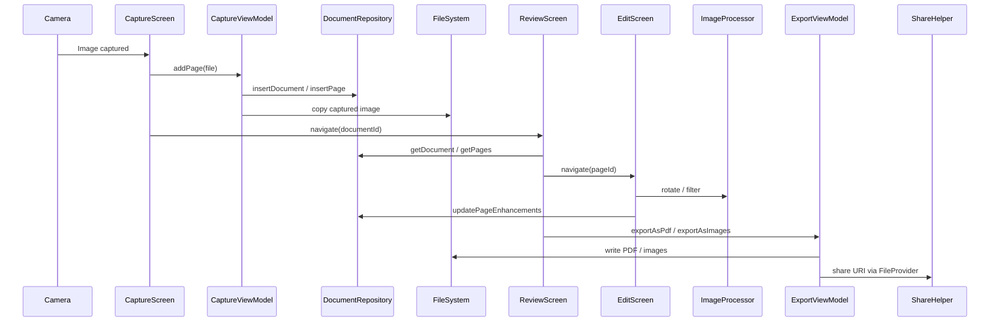

# Architecture

## Overall Architecture

OpenScan follows an **MVVM + State Machine** architecture with a single-module layout:

```
┌──────────────────────────────────────────────────────┐
│                  UI Layer (Compose)                   │
│  HomeScreen, CaptureScreen, ReviewScreen, EditScreen, │
│  CropScreen, GalleryScreen, SettingsScreen            │
├──────────────────────────────────────────────────────┤
│                ViewModel Layer                        │
│  CaptureViewModel, ReviewViewModel, EditViewModel,    │
│  CropViewModel, GalleryViewModel, ExportViewModel     │
├──────────────────────────────────────────────────────┤
│            State Machine (Workflow Blueprint)          │
│  LensStateMachine — sealed class state transitions   │
│  States: Idle → Capturing → Reviewing →              │
│          Editing → Cropping → Exporting               │
├──────────────────────────────────────────────────────┤
│             Service / Manager Layer                   │
│  ImageProcessor, PdfExporter, OcrEngine,              │
│  BarcodeScanner, ShareHelper, FileUtils              │
├──────────────────────────────────────────────────────┤
│             Data / Persistence Layer                  │
│  Room DB (openscan.db: documents, pages tables)      │
│  File system (captured images, exports)              │
├──────────────────────────────────────────────────────┤
│              Dependency Injection (Hilt)              │
│  AppModule (@Singleton): DatabaseProvider,            │
│  DocumentRepository, ImageProcessor, PdfExporter     │
└──────────────────────────────────────────────────────┘
```

## Application Class Hierarchy

```
android.app.Application
  └── com.openscan.app.OpenScanApp (@HiltAndroidApp)
```

`OpenScanApp` is a 7-line `@HiltAndroidApp` Application subclass — no custom initialization beyond Hilt.

## Activity Hierarchy

```
ComponentActivity (AndroidX)
  └── MainActivity (@AndroidEntryPoint)
```

Single-activity architecture. `MainActivity` installs splash screen, enables edge-to-edge, and sets Compose content with `OpenScanTheme { OpenScanNavHost() }`.

## Navigation

Defined in `navigation/NavGraph.kt`. Uses Compose Navigation with a `Routes` object:

| Route | Screen | Parameters |
|-------|--------|------------|
| `HOME` | HomeScreen (bottom nav tabs) | — |
| `CAPTURE` | CaptureScreen | — |
| `REVIEW/{documentId}` | ReviewScreen | documentId: Long |
| `EDIT/{pageId}` | EditScreen | pageId: Long |
| `CROP/{pageId}` | CropScreen | pageId: Long |
| `GALLERY` | GalleryScreen | — |

Navigation transitions are driven imperatively via `NavController` callback lambdas passed from ViewModels.

## State Machine

Defined in `scanner/LensStateMachine.kt` — sealed class hierarchy:

```
LensState (sealed)
  ├── Idle
  ├── Capturing
  ├── Reviewing
  ├── Editing
  ├── Cropping
  └── Exporting

LensEvent (sealed)
  ├── OpenCamera
  ├── PageCaptured
  ├── PageAccepted
  ├── EditPage
  ├── CropPage
  ├── ExportDocument
  ├── Back
  └── Done
```

`LensStateMachine` manages transitions via `transition(event)`.

**Note**: The state machine currently serves as the architectural blueprint. Actual navigation is handled by `NavController` in `NavGraph.kt`; ViewModels manage their own UI state via `StateFlow` and trigger navigation through callbacks.

## Data Flow



## Initialization Sequence

1. `OpenScanApp.onCreate()` — Hilt DI initialization
2. `MainActivity.onCreate()` — splash screen, edge-to-edge, Compose content
3. `OpenScanNavHost()` — route resolution, screen composition
4. Screen composables — ViewModel injection via `hiltViewModel()`

## Design Patterns

| Pattern | Usage |
|---------|-------|
| **ViewModel** | Per-screen ViewModels with `@HiltViewModel` |
| **Repository** | `DocumentRepository` wraps both DAOs |
| **StateFlow** | Asynchronous state emission from ViewModels |
| **Sealed Class** | `LensState` / `LensEvent` for state machine |
| **Singleton** | Hilt `@Singleton` scoped DI (AppModule) |
| **FileProvider** | Secure URI sharing for exports |

## Dependency Injection

Hilt with `@Singleton` component. Modules defined in `di/AppModule.kt`:

| Binding | Implementation |
|---------|---------------|
| `DatabaseProvider` | Room database singleton |
| `DocumentRepository` | Repository wrapping DocumentDao + PageDao |
| `ImageProcessor` | Bitmap manipulation utilities |
| `PdfExporter` | PDF generation via `android.graphics.pdf.PdfDocument` |
