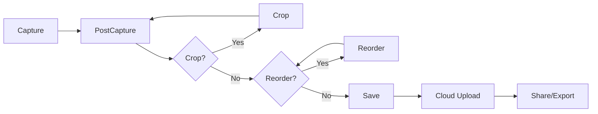
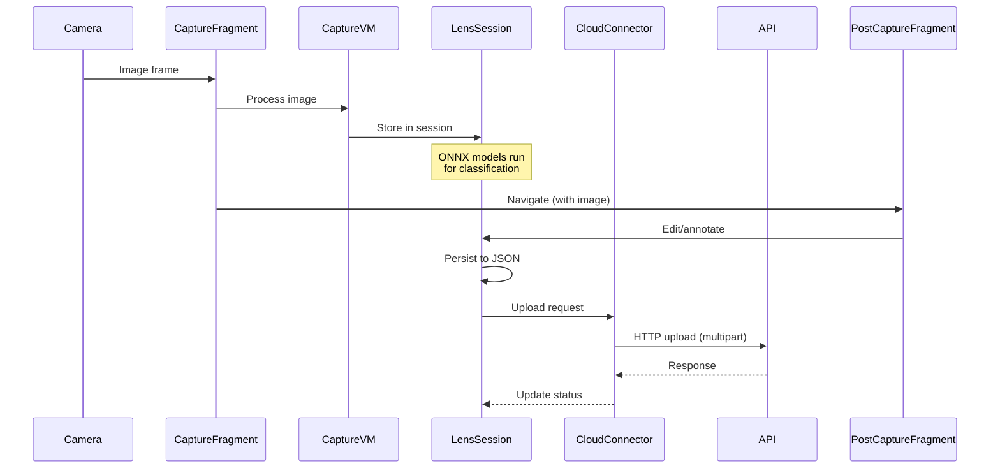

# Architecture

## Overall Architecture

Microsoft Lens follows a **component-based architecture** with a layered design:

```
┌─────────────────────────────────────────────────────┐
│                   Activities                         │
│  MainActivity, SecureActivity, ImmersiveGallery...   │
├─────────────────────────────────────────────────────┤
│                   Fragments                          │
│  CaptureFragment, PostCaptureFragment, Gallery...    │
├─────────────────────────────────────────────────────┤
│                ViewModels + Factories                 │
│  CaptureFragmentViewModel, PostCaptureVM...          │
├─────────────────────────────────────────────────────┤
│             Component / Workflow Layer               │
│  CaptureComponent, PostCaptureComponent,             │
│  ScanComponent, SaveComponent, OcrComponent...       │
├─────────────────────────────────────────────────────┤
│              Command / Action Layer                  │
│  CommandRegistry, ActionRegistry, ActionHandler      │
├─────────────────────────────────────────────────────┤
│              Service / Manager Layer                 │
│  SessionManager, CloudConnectManager, AccountMgr... │
├─────────────────────────────────────────────────────┤
│            Data / Persistence Layer                  │
│  Room DB, SQLite, SharedPrefs, File-based, DataModel│
├─────────────────────────────────────────────────────┤
│            Network / API Layer                       │
│  Retrofit, OkHttp, CloudConnector, SimpleRESTClient │
├─────────────────────────────────────────────────────┤
│               Native Libraries (JNI)                 │
│  libOfficeLens, libofficecrypto, libmso*.so...      │
└─────────────────────────────────────────────────────┘
```

## Application Class Hierarchy

```
android.app.Application
  └── com.microsoft.intune.mam.client.app.MAMApplication
        └── com.microsoft.office.apphost.OfficeApplication
              └── com.microsoft.office.officelens.OfficeLensApplication
```

`OfficeLensApplication` is the main entry point. It extends `OfficeApplication` which extends the Intune-wrapped `MAMApplication`, providing:
- Intune MAM lifecycle management
- Shared Office platform initialization
- Native library loading (`officecrypto`, `mso20android`, `mso30android`, etc.)
- Session management
- Rate app logic

## Activity Inheritance

```
AppCompatActivity
  ├── LensFoldableAppCompatActivity
  │     └── LensActivity (core SDK activity)
  ├── AuthenticationBaseActivity
  │     └── LoadingBaseActivity
  │           └── SignInWrapperActivity
  ├── FirstRunActivity
  ├── SecureActivity
  ├── ImmersiveGalleryActivity
  └── IRActivity (Immersive Reader)

MAMActivity (Intune-wrapped)
  ├── OfficeActivity
  │     └── MainActivity
  ├── AboutActivity
  ├── SettingsActivity
  └── PermissionRequestActivity
```

## Fragment Inheritance

```
Fragment (AndroidX)
  ├── LensFragment (core SDK base fragment)
  │     ├── CaptureFragment
  │     ├── PostCaptureFragment
  │     ├── ImmersiveGalleryFragment
  │     ├── ReorderFragment
  │     ├── CropFragment
  │     ├── ActionViewFragment
  │     ├── BaseExtractEntityFragment (abstract)
  │     │     ├── ExtractEntityFragment
  │     │     └── EntityExtractorFragment
  │     ├── LensVideoFragment (abstract)
  │     └── LensBarcodeFragment (abstract)
  │           └── BarcodeScanFragment
  ├── LensDialogFragment
  │     ├── LensBaseAlertDialogFragment
  │     │     └── LensAlertDialogFragment
  │     ├── LensProgressDialogFragment
  │     └── ResolutionSelectDialogFragment
  ├── LensCopilotFragment (abstract)
  └── MAMFragment (Intune-wrapped)
        ├── OfficeLensFragment (app base)
        │     ├── InformationFragment
        │     └── RecentEntryFragment
        ├── FrePrivacyFragment
        ├── UseTermsFragment
        ├── VideoExperienceFragment
        ├── WhatsNewFragment
        ├── VideoPageFragment
        ├── FolderListFragment
        └── ControllerFragment
```

## Component System

The app uses a modular **component system** centered around interfaces:

- `ILensComponent` — base component interface
- `ILensWorkflowComponent` — workflow-aware component
- `ILensWorkflowUIComponent` — component with UI

### Major Components

| Component | Responsibility |
|-----------|---------------|
| `CaptureComponent` | Camera capture |
| `PostCaptureComponent` | Post-capture review/edit |
| `ScanComponent` | Scan processing pipeline |
| `SaveComponent` | Save/packaging |
| `OcrComponent` | OCR integration |
| `InkComponent` | Ink annotation |
| `TextStickerComponent` | Text stickers |
| `CropComponent` | Image cropping |
| `ReorderComponent` | Page reordering |

## Workflow System

The `WorkflowNavigator` manages screen transitions through a workflow definition system:



### Workflow Types

- Scan
- Photo
- BusinessCard
- ImageToText
- ImageToTable
- ImmersiveReader
- Barcode
- Video

## Data Flow



## Initialization Sequence

1. `Application.onCreate()` — Intune MAM init, native library loading, WorkManager config, telemetry init
2. `MainActivity.onCreate()` — permission checks, account initialization, session restoration
3. `LensActivity.onCreate()` — workflow setup, component registration
4. `CaptureFragment` — camera initialization, preview start
5. Post-capture: user edits → Save → Upload/Share

## Design Patterns

| Pattern | Usage |
|---------|-------|
| **Command** | CommandRegistry, ActionRegistry for undoable operations |
| **ViewModel** | Per-fragment ViewModels with custom ProviderFactory |
| **Singleton** | LensSessions, SessionManager, AccountManager |
| **Observer** | LiveData, event notifications for persistence |
| **Strategy** | Workflow types determine component chain |
| **Factory** | ViewModelProviderFactory for all ViewModels |
| **Proxy** | AutoDiscoveryServiceProxy, RetrofitProvider |
| **Interceptor** | OkHttp interceptors for auth, logging, pinning |

## Dependency Injection

The app does **not** use Dagger, Hilt, or Koin. DI is manual through:
- `ViewModelProviderFactory` subclasses
- `ServiceLocator`-style singletons
- Static utility classes
- `LensDynamicClassLoader` for dynamic component loading

## Foldable Device Support

- `LensFoldableAppCompatActivity` provides dual-screen support
- `LensFoldableActivityLayout` manages spanned layouts
- `LensFoldableSpannedPageData` handles page data on foldable screens
