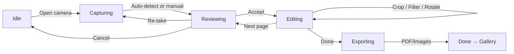
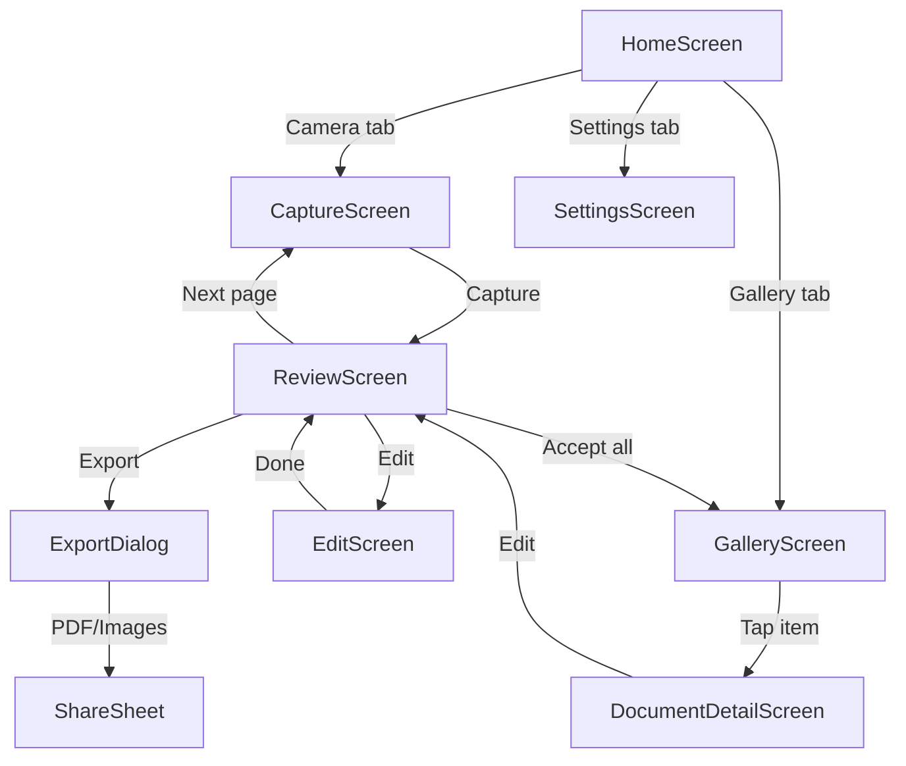

# Implementation Plan: Open-Source Document Scanner

> Based on the reverse engineering of Microsoft Office Lens (v16.0.18526.20136).
>
> This document describes a new open-source Android application that provides local-only
> document scanning without any Microsoft code, cloud services, authentication, or telemetry.

---

## 1. Scope

### What the App Does

- Capture documents, whiteboards, and photos using the device camera
- Auto-detect document/whiteboard borders in the viewfinder
- Manually adjust crop regions
- Apply image enhancements: perspective correction, color/grayscale filters, auto-contrast
- Capture multi-page documents
- Reorder, rotate, and delete pages
- Export as **PDF** and **PNG/JPEG** images — no other output formats
- Barcode and QR code scanning (read-only, no cloud lookup)
- OCR text extraction (on-device, for copy-to-clipboard)
- Gallery of past scans with thumbnail grid
- On-device storage only — no cloud sync

### What the App Does NOT Do

| Feature | Reason for Exclusion |
|---------|---------------------|
| Business card recognition | Requires contact DB integration & cloud entity extraction |
| OneNote / Word / PPTX export | Proprietary formats & Microsoft IP |
| Copilot / AI chat | Cloud-dependent, Microsoft service |
| Cloud sync (OneDrive, SharePoint) | Cloud feature |
| Account management / sign-in | No cloud, no identity needed |
| Intune / MDM / enterprise policies | Enterprise-only, unnecessary for consumer app |
| Telemetry / analytics | No data leaves the device |
| Crash reporting | No data leaves the device |
| License verification / DRM | Fully FOSS |
| Cross-app SSO / token sharing | Requires Microsoft auth ecosystem |
| YubiKey / FIDO2 2FA | No accounts = no need for 2FA |
| Print | Can be done via Android system share sheet |
| Immersive Reader (TTS) education features | Google's built-in Select-to-Speak covers this; too complex for v1 |
| Video capture | Out of scope for a document scanner |
| Table extraction | Requires complex ML, out of scope for v1 |

---

## 2. Architecture

### Proposed: MVVM + State Machine

Replace Microsoft Lens's component-based architecture with a simpler **MVVM + state machine** approach:

```
┌──────────────────────────────────────────────────┐
│                  UI Layer                         │
│  Jetpack Compose Screens (state-driven)          │
│  CaptureScreen, ReviewScreen, EditScreen,        │
│  GalleryScreen, ExportScreen                     │
├──────────────────────────────────────────────────┤
│              ViewModel Layer                      │
│  CaptureViewModel, ScanViewModel,                │
│  DocumentViewModel, GalleryViewModel             │
├──────────────────────────────────────────────────┤
│            State Machine (Workflow)               │
│  LensStateMachine — drives screen transitions    │
│  States: Idle → Capturing → Reviewing →          │
│          Editing → Exporting                      │
├──────────────────────────────────────────────────┤
│             Service / Manager Layer               │
│  CameraManager, DocumentDetector, ImageProcessor,│
│  PdfExporter, OcrEngine, BarcodeScanner          │
├──────────────────────────────────────────────────┤
│             Data / Persistence Layer              │
│  Room DB (documents, pages, settings)            │
│  File system (images, PDF output)                │
└──────────────────────────────────────────────────┘
```

### State Machine Flow



### Key Architectural Differences from Lens

| Aspect | Original Lens | New App |
|--------|--------------|---------|
| **Architecture** | Component-based (ILensComponent) | MVVM + State Machine |
| **DI** | Manual ViewModelProviderFactory | Hilt (simpler than manual factories) |
| **UI** | XML layouts with Fragments | Jetpack Compose (single-activity) |
| **Navigation** | WorkflowNavigator + Fragments | Compose Navigation (NavHost) |
| **State management** | LiveData | StateFlow (Kotlin coroutines) |
| **Background work** | WorkManager + JobScheduler | Kotlin Coroutines (simple enough) |

---

## 3. Technology Stack

| Layer | Recommendation | Rationale |
|-------|---------------|-----------|
| **Language** | Kotlin 2.x | Modern, concise, coroutine-native |
| **UI** | Jetpack Compose + Material 3 | Declarative, modern, no XML overhead |
| **DI** | Hilt | De facto standard, simpler than manual factories |
| **Camera** | CameraX | Official Android camera API (already open-source) |
| **Document detection** | OpenCV (contour detection) or ML Kit (on-device) | Both open-source, no cloud calls |
| **Image processing** | OpenCV or Android `Bitmap` + `RenderScript` | Perspective warp, filters, contrast |
| **PDF export** | Android `PdfDocument` API (built-in) | No external dependency needed for basic PDF |
| **OCR** | ML Kit Text Recognition (on-device) | Google Play Services, free, on-device only |
| **Barcode/QR** | ML Kit Barcode Scanning (on-device) | Same as OCR — on-device Play Services |
| **Storage** | Room + file system | Standard AndroidX, local-only |
| **Navigation** | Compose Navigation | Official, type-safe |
| **Coroutines** | Kotlinx Coroutines + StateFlow | Standard async pattern |
| **Build** | AGP + Kotlin DSL Gradle | Standard Android toolchain |

### What We Are NOT Using (and Why)

| Avoid | Reason |
|-------|--------|
| Retrofit / OkHttp | No network calls needed |
| Gson / Moshi | No JSON serialization needed (Room handles schema) |
| DataStore | Room is sufficient for relational document/page data |
| WorkManager | No background network work; image processing is fast enough for foreground |
| Firebase / Crashlytics | No telemetry, no crash reporting |
| Any Microsoft SDK | Constraint: zero Microsoft code |
| ONNX Runtime | Complex, unnecessary; OpenCV contour detection is sufficient for border detection |

---

## 4. Feature Implementations

### 4.1 Camera Capture with Auto-Detect

**Status: Modified**

**Implementation:**
- Use CameraX `PreviewView` for viewfinder, `ImageCapture` for still shots
- On each preview frame (sampled every N frames), run a lightweight document border detection:
  - **Option A (OpenCV)**: Convert frame to grayscale, apply Gaussian blur, Canny edge detection, find contours, approximate the largest 4-point polygon
  - **Option B (ML Kit)**: Use ML Kit's on-device image labeling or a custom TFLite model for document corner regression
- When a valid quadrilateral is found, overlay a yellow border on the preview
- User can tap to capture, or auto-capture when stable border is detected
- CameraX `ImageCapture` saves to `captured/` directory using `ContentResolver` / file output

**Differences from Lens:**
- Lens used ONNX Runtime (mnv2_ep42_wb_quant.ort + triclass_doc_classifier.ort) for document type classification. We skip classification and use pure contour detection.
- Lens offered mode selection (Document/Photo/Whiteboard/Business Card/Auto). We simplify to: Document (auto-detect), Photo (no detection), and QR/Barcode.

### 4.2 Image Enhancement

**Status: Modified**

**Implementation:**
- Perspective correction: `OpenCV.getPerspectiveTransform()` + `warpPerspective()`, or manually via `Matrix` with `Bitmap.createBitmap()`
- Filters: Use `ColorMatrix` for grayscale, `RenderScript` for contrast/brightness, `Bitmap` for original
- Auto-crop: Apply the detected quadrilateral as the crop region automatically
- User-adjustable crop handles after capture

**Differences from Lens:**
- Lens used native `libOfficeLens.so` and Skia (`libskiaoffice.so`) for rendering. We use Android SDK + OpenCV Java bindings.
- Remove ink annotation and text stickers (can be added in later versions).

### 4.3 Crop/Edit

**Status: Modified**

**Implementation:**
- Compose `Canvas` with `PointerInputScope` for draggable crop handles
- Aspect ratio presets: Free, 4:3, 3:4, 16:9, 9:16, Square
- Rotation: `Bitmap.createBitmap()` with `Matrix.postRotate()`
- Perspective correction: 4-corner draggable points with `OpenCV.findHomography()` + `warpPerspective()`
- Accept/Cancel buttons

**Differences from Lens:**
- Lens used `CropFragment` with complex View-based touch handling. We use Compose gestures.
- No foldable-specific layout handling (can be added later if needed).

### 4.4 Reorder Pages

**Status: Modified**

**Implementation:**
- Jetpack Compose `LazyColumn` with drag-and-drop (using `org.burnoutcrew:reorderable` library or manual `detectDragGesturesAfterLongPress`)
- Thumbnail previews loaded from `{filesDir}/captured/` image files
- Long-press to drag, drop to reorder, swipe to delete
- Add page button returns to camera

**Differences from Lens:**
- Lens used `ReorderFragment` with XML + `LensFoldableAppCompatActivity`. We use Compose drag-to-reorder.
- Simpler UX — no foldable support needed for v1.

### 4.5 Export to PDF / Images

**Status: Modified**

**Implementation:**
- **PDF**: Android `android.graphics.pdf.PdfDocument`
  - Create `PdfDocument`, for each page: `startPage()` → draw `Bitmap` via `Canvas.drawBitmap()` → `finishPage()`
  - Write to `Documents/{appName}/{filename}.pdf` via `MediaStore` (API 29+) or direct file (legacy)
  - Page size: Match the captured document dimensions, default to A4
- **Images**: Write `Bitmap` as PNG/JPEG to `Pictures/{appName}/{filename}.{png,jpg}` via `MediaStore`
- Share sheet: Use `FileProvider` + `Intent.ACTION_SEND` with `content://` URI for PDF/image

**Differences from Lens:**
- Lens used Apache PDFBox (tom_roush port) for PDF with more options (OCR layer, searchable PDF). We use the simpler built-in `PdfDocument` API for v1.
- Lens exported to DOCX, PPTX, OneNote — removed entirely.
- Lens had cloud upload destinations — removed entirely.

### 4.6 Gallery / Recent Items

**Status: Kept (modified)**

**Implementation:**
- Room database table `documents` with columns: id, title, created_at, page_count, thumbnail_path
- Room database table `pages` with columns: id, document_id (FK), page_number, image_path, rotation, filter_type
- `GalleryScreen` with `LazyVerticalGrid` showing thumbnails loaded with `Coil` or `Glide`
- Tap to view document details, long-press for multi-select
- Actions: View, Share, Delete, Export
- Uses `FileProvider` for sharing

**Differences from Lens:**
- Lens used `RecentEntryDbHelper` (SQLiteOpenHelper) with cloud-backed fields (client_url, web_url, owner, item_id). We use Room with local-only fields.
- Lens showed cloud status (synced/pending/error). We remove cloud status.

### 4.7 Barcode and QR Scanning

**Status: Kept**

**Implementation:**
- ML Kit Barcode Scanning (on-device, via Google Play Services)
- `CameraX` preview with `ImageAnalysis.Analyzer`
- On detection: show result in bottom sheet with options:
  - Copy text to clipboard
  - Open URL (if detected URL)
  - Share result
- Support formats: QR Code, EAN-8/13, UPC-A/E, Code 39/128, PDF417, Data Matrix, Aztec

**Differences from Lens:**
- Lens had its own `BarcodeScanFragment` with custom camera integration. We use ML Kit's built-in barcode scanner over CameraX.
- No business card mode (which Lens also handled via barcode → entity extraction).

### 4.8 OCR / Text Extraction

**Status: Kept (simplified)**

**Implementation:**
- ML Kit Text Recognition (on-device, via Google Play Services)
- `CameraX` `ImageAnalysis.Analyzer` or post-capture processing
- After capture and enhancement, optionally run OCR
- Display recognized text in a scrollable overlay
- Tap to select text, copy to clipboard
- Exposed as a button in the Review screen ("Extract Text")

**Differences from Lens:**
- Lens used ML Kit and also had cloud-based OCR fallback via `ImageToDoc` API. We are on-device only.
- Lens's Immersive Reader integration with TTS, font controls, grammar tools — removed for v1.

---

## 5. Removed Features Checklist

| Feature | Replacement / Rationale |
|---------|------------------------|
| **Business Cards** | Removed. Entity extraction requires cloud APIs; contact saving is out of scope. |
| **OneNote export** | Removed. Microsoft proprietary format and API. |
| **Word / DOCX export** | Removed. Microsoft proprietary format. |
| **PPTX export** | Removed. Microsoft proprietary format. |
| **Copilot / Bing Chat AI** | Removed. Cloud service, Microsoft IP. |
| **Immersive Reader** | Removed. Complex TTS/education feature; Android's Select-to-Speak is a sufficient substitute. |
| **Cloud sync (OneDrive/SharePoint)** | Removed. No cloud features. |
| **Account management** | Removed. No identity required. |
| **Intune MAM** | Removed. Enterprise-only, unnecessary for consumer app. |
| **Telemetry (Aria/EVT/Nexus)** | Removed. No data leaves the device. |
| **Crash reporting (HockeyApp/AppCenter)** | Removed. No data leaves the device. |
| **License verification (Google LVL + MS)** | Removed. Fully FOSS, no DRM. |
| **Token sharing (cross-app SSO)** | Removed. Requires Microsoft auth ecosystem. |
| **YubiKey / FIDO2** | Removed. No accounts = no 2FA. |
| **Video capture** | Removed. Out of scope for document scanner. |
| **Table extraction** | Removed. Complex ML, out of scope for v1. |
| **Ink annotation** | Removed. Can be added in v2; not core to scanning. |
| **Text stickers** | Removed. Can be added in v2. |
| **Foldable device support** | Removed. Can be added later; not critical for v1. |
| **Wear OS support** | Removed. Not needed for a camera-based scanning app. |
| **Native libraries (libOfficeLens, libmso*, libofficecrypto, etc.)** | Removed. All 31 .so files replaced by Android SDK + OpenCV. |
| **ONNX Runtime models** | Removed. Replaced by OpenCV contour detection. |
| **TFLite model** | Removed. Replaced by OpenCV contour detection for v1. |

---

## 6. UI Screens

Mapped from `docs/ui.md` (original Lens screens).

### Kept (with modifications)

| Original Screen | New Screen | Modifications |
|-----------------|-----------|---------------|
| Capture (main camera) | `CaptureScreen` | No mode picker (just document/photo toggle); no flash toggle (auto); no overflow menu with Recent/Settings (moved to bottom nav) |
| Post-Capture | `ReviewScreen` | Simplified: accept, re-take, crop, filters. Removed: ink, text stickers, OneNote/cloud buttons |
| Crop/Edit | `EditScreen` | Same crop controls + perspective correction. Removed: foldable-specific layouts |
| Gallery/Recent Items | `GalleryScreen` | Same grid layout. Removed: cloud status indicators, OneDrive paths |
| Reorder pages | `ReorderSheet` | Same drag-to-reorder. Removed: foldable dual-page layout |
| Barcode result sheet | `BarcodeSheet` | Same result display. Removed: business card mode |

### New Screens

| Screen | Purpose |
|--------|---------|
| `HomeScreen` | Bottom nav hub: Camera, Gallery, Settings |
| `ExportDialog` | Format picker (PDF / PNG / JPEG), quality selector, share button |

### Removed Entirely

| Screen | Reason |
|--------|--------|
| Splash Screen (MainActivity theme) | Not needed — no heavy initialization |
| First Run (FRE: privacy, terms, tutorial) | No telemetry + no accounts = no privacy/terms flow needed; a simple one-time "welcome" is sufficient |
| Sign-In / Account Picker | No accounts |
| Save Screen (cloud destinations) | No cloud saves — export is immediate |
| Settings (account section, sign out) | No accounts — just app info, about, licenses |
| About | Trimmed to a simple dialog |
| Immersive Reader (IRActivity) | Removed entirely |
| Business Card result | Removed entirely |
| Copilot fragment | Removed entirely |
| OneNote picker | Removed entirely |
| OneDrive picker | Removed entirely |

### Navigation Structure



---

## 7. Data Model

### Document Model (Room Entity)

```kotlin
@Entity(tableName = "documents")
data class Document(
    @PrimaryKey(autoGenerate = true)
    val id: Long = 0,
    val title: String,
    val createdAt: Long = System.currentTimeMillis(),
    val updatedAt: Long = System.currentTimeMillis(),
    val pageCount: Int = 0,
    val thumbnailPath: String? = null
)
```

### Page Model (Room Entity)

```kotlin
@Entity(
    tableName = "pages",
    foreignKeys = [
        ForeignKey(
            entity = Document::class,
            parentColumns = ["id"],
            childColumns = ["documentId"],
            onDelete = ForeignKey.CASCADE
        )
    ]
)
data class Page(
    @PrimaryKey(autoGenerate = true)
    val id: Long = 0,
    val documentId: Long,
    val pageNumber: Int,
    val imagePath: String,  // Path to captured image file
    val rotation: Int = 0,  // 0, 90, 180, 270
    val filterType: String = "original"  // "original", "grayscale", "document"
)
```

### Image Storage

```
{appFilesDir}/
  captured/
    {uuid}.jpg          # Original captured image
    {uuid}_enhanced.jpg # After perspective correction + filter
  thumbnails/
    {uuid}_thumb.jpg    # Thumbnail for gallery grid
  exports/
    {title}.pdf         # Exported PDF
    {title}/            # Exported multi-image folder
      page_001.png
      page_002.png
```

### Key Differences from Lens Data Model

| Aspect | Original Lens | New App |
|--------|--------------|---------|
| Storage format | Java `.properties` files per doc | Room database |
| Session model | Complex `LensSession` with JSON serialization | Simple in-memory state + Room |
| Cloud-backed fields | `service`, `client_url`, `web_url`, `owner`, `item_id` | None |
| Image location | Multiple dirs (`images/`, `uploads/`, `ocr/`) | Single `captured/` dir |
| Thumbnail | Separate `RecentEntry.db` with `thumbnail_name` | Stored as file path in Room |

---

## 8. File Format

### On-Device Saved Format: PDF

The primary on-device format is **standard PDF** (not a proprietary format).

- PDF structure: Each page = one image embedded at full resolution
- Optional: OCR text layer as invisible text overlay (PDF `Text` objects) — v2 feature
- No `.document`, `.per`, or other proprietary intermediate formats
- Images are also saved separately in the `Pictures/` directory via `MediaStore` for gallery access

### Export Flow

```
User taps Export
  → Choose format: PDF, PNG, or JPEG
  → Choose quality: High / Medium / Low (affects JPEG compression)
  → Choose destination: Share sheet or Save to device
  → For PDF: PdfDocument writes to temp file, then FileProvider share
  → For Images: Write to MediaStore, then share
```

---

## 9. Dependencies

### Open-Source Libraries to Include

| Library | Version | Purpose |
|---------|---------|---------|
| `androidx.compose.ui` | latest | Compose UI toolkit |
| `androidx.compose.material3` | latest | Material 3 design |
| `androidx.navigation:navigation-compose` | latest | Type-safe navigation |
| `androidx.camera:camera-camera2` | latest | CameraX core |
| `androidx.camera:camera-lifecycle` | latest | Camera lifecycle binding |
| `androidx.camera:camera-view` | latest | PreviewView |
| `androidx.room:room-runtime` | latest | Local database |
| `androidx.room:room-ktx` | latest | Room coroutines |
| `androidx.room:room-compiler` | latest | Room annotation processor |
| `com.google.dagger:hilt-android` | latest | Dependency injection |
| `com.google.dagger:hilt-compiler` | latest | Hilt processor |
| `androidx.hilt:hilt-navigation-compose` | latest | Hilt + Compose integration |
| `com.google.mlkit:text-recognition` | latest | On-device OCR |
| `com.google.mlkit:barcode-scanning` | latest | On-device barcode/QR |
| `org.opencv:opencv-android` (or custom build) | 4.x | Contour detection, perspective warp, image processing |
| `io.coil-kt:coil-compose` | latest | Image loading for thumbnails |
| `androidx.documentfile:documentfile` | latest | SAF file access for export |

### Microsoft Dependencies to Drop

| Dependency | Reason |
|------------|--------|
| `com.microsoft.intune.mam` | Enterprise MDM, removed |
| `com.microsoft.identity.client` (MSAL) | Auth, removed |
| `com.microsoft.identity.common` (ADAL) | Auth, removed |
| `com.microsoft.onerest` (ODSP) | OneDrive SDK, removed |
| `com.microsoft.office.officecrypto` | Document encryption, removed |
| `com.microsoft.appcenter` | Crash reporting, removed |
| `com.microsoft.hockeyapp` | Crash reporting, removed |
| `com.microsoft.aria` (EVT) | Telemetry, removed |
| `com.microsoft.nexus` | Telemetry, removed |
| `com.microsoft.token.share` | Cross-app SSO, removed |
| All `libmso*.so` native libraries | Office platform, removed |
| `libOfficeLens.so` | Core Lens native code, removed |
| `libofficecrypto.so` | Encryption, removed |
| `libofficessl.so` | SSL networking, removed |
| `libskiaoffice.so` | Graphics, removed |

### Dependencies Lens Used That We Repurpose (Open-Source)

| Library | Lens Usage | New App Usage |
|---------|-----------|---------------|
| `tom-roush:pdfbox-android` | PDF generation | **Not used** — replaced by `android.graphics.pdf.PdfDocument` (built-in) |
| `com.google.mlkit:text-recognition` | OCR | Same |
| `com.google.mlkit:barcode-scanning` | Barcode | Same |
| `androidx.camera:camera-camera2` | Camera | Same |
| `androidx.room:room-runtime` | Registry.db | Same (for document/page storage) |
| `org.opencv:opencv-android` | Not used by Lens | New — replaces ONNX document detection |

---

## 10. Development Roadmap

### Phase 1: Core Capture (2-3 weeks)

- Project setup: Kotlin, Compose, Hilt, Gradle
- `CaptureScreen` with CameraX preview
- Shutter button, save captured image to file
- Basic preview of captured image (no editing yet)
- `GalleryScreen` with `LazyVerticalGrid` showing thumbnail list
- Room database for documents + pages
- Export single image as PNG/JPEG

### Phase 2: Image Processing (2-3 weeks)

- OpenCV integration for contour-based document detection
- Perspective correction (`warpPerspective`)
- Crop UI with draggable handles
- Filters: grayscale, color
- Rotation (90° steps)
- Multi-page support: capture more pages, reorder with drag-and-drop
- Thumbnail generation

### Phase 3: Export & Polish (2-3 weeks)

- PDF export using `android.graphics.pdf.PdfDocument`
- Share sheet integration via `FileProvider`
- Export format picker (PDF / PNG / JPEG)
- Barcode/QR scanning with ML Kit
- OCR with ML Kit (copy recognized text to clipboard)
- Settings screen: about, licenses, clear data
- Edge-to-edge Material 3 theming

### Phase 4: Refinement (1-2 weeks)

- Dark mode support
- RTL layout support
- Error handling edge cases
- App icon, launch screen
- Performance optimization (bitmap loading, caching)
- ProGuard rules
- CI pipeline (lint, build test, GitHub Actions)

### Out of Scope (Post-v1 Ideas)

- Searchable PDF (OCR text layer embedded in PDF)
- Advanced filters (auto-contrast, sharpen, binarize)
- Batch export (all pages as separate images)
- Ink annotation
- Custom page sizes in PDF
- Document tagging and search
- Edge-to-edge scanning stitching

---

## Appendix: Design Decisions

### Why Jetpack Compose Instead of XML Layouts?

- Lens used 337 XML layout files with complex Fragment-based navigation
- Compose reduces boilerplate, eliminates XML inflation overhead
- Declarative state management pairs naturally with state machine architecture
- Single-activity architecture simplifies lifecycle

### Why OpenCV Instead of ONNX Runtime?

- Lens's ONNX models (`mnv2_ep42_wb_quant.ort`, `triclass_doc_classifier.ort`) classify document **type** (whiteboard vs document vs photo) but the core border detection can be done with classical CV
- OpenCV contour detection is well-understood, deterministic, and requires no model file
- ONNX Runtime adds ~6 MB of native library per architecture (only 32-bit ARM was provided)
- If ML-based detection proves significantly better, a TFLite model can be added later

### Why Android PdfDocument Instead of PDFBox?

- `PdfDocument` is built into Android SDK — zero additional dependency size
- PDFBox adds ~6 MB APK size (the `tom-roush` port)
- For a simple "embed image per page" PDF, `PdfDocument` is sufficient
- Can migrate to PDFBox/iText later if searchable PDF (text layer) becomes necessary

### Why No Telemetry?

- The original Lens integrated Aria/EVT, Nexus, HockeyApp, and App Center — four telemetry systems
- Zero-telemetry simplifies privacy compliance (no GDPR consent dialogs needed)
- Users can opt in to Google Play's crash reporting if desired (but it defaults off)
