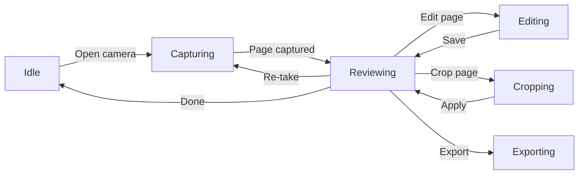

# Implementation — Current State

## Architecture

### MVVM + State Machine

The app uses a layered architecture with Jetpack Compose UI, `@HiltViewModel` ViewModels, and Room persistence:

```
┌──────────────────────────────────────────────────┐
│                  UI Layer                         │
│  Jetpack Compose Screens (state-driven)          │
│  HomeScreen, CaptureScreen, ReviewScreen,        │
│  EditScreen, CropScreen, GalleryScreen           │
├──────────────────────────────────────────────────┤
│              ViewModel Layer                      │
│  CaptureViewModel, ReviewViewModel, EditViewModel,│
│  CropViewModel, GalleryViewModel, ExportViewModel │
├──────────────────────────────────────────────────┤
│            State Machine (Blueprint)              │
│  LensStateMachine — sealed class transitions     │
│  States: Idle → Capturing → Reviewing →          │
│          Editing → Cropping → Exporting           │
├──────────────────────────────────────────────────┤
│             Service / Manager Layer               │
│  ImageProcessor, PdfExporter, OcrEngine,         │
│  BarcodeScanner, ShareHelper, FileUtils          │
├──────────────────────────────────────────────────┤
│             Data / Persistence Layer              │
│  Room DB (documents, pages)                      │
│  File system (captured images, exports)          │
└──────────────────────────────────────────────────┘
```

**Key architectural note**: The `LensStateMachine` defines the theoretical workflow states, but navigation is driven imperatively via `NavController`. ViewModels manage their own UI state via `StateFlow`.

### State Machine Flow



## Technology Stack (as implemented)

| Layer | Implementation |
|-------|---------------|
| **Language** | Kotlin 2.1.0 |
| **UI** | Jetpack Compose + Material 3 |
| **DI** | Hilt 2.53.1 |
| **Camera** | CameraX 1.4.1 |
| **Document detection** | Manual corner drag in Crop screen (no auto-detection in preview) |
| **Image processing** | Android `Bitmap` + `Matrix` + `ColorMatrix` (no OpenCV) |
| **PDF export** | Android `PdfDocument` API (built-in) |
| **OCR** | ML Kit Text Recognition 16.0.1 (on-device) |
| **Barcode/QR** | ML Kit Barcode Scanning 17.3.0 (on-device) |
| **Storage** | Room 2.6.1 + file system |
| **Navigation** | Compose Navigation 2.8.5 |
| **Images** | Coil 2.7.0 |
| **Coroutines** | Kotlinx Coroutines 1.9.0 |
| **Build** | AGP 8.7.3 + Kotlin DSL Gradle |

### Deviations from Original Plan

| Planned | Actual | Reason |
|---------|--------|--------|
| OpenCV for border detection | Not used; manual corner drag in CropScreen | Compose Canvas + drag gestures sufficient; avoids native library size |
| OpenCV for perspective warp | `ImageProcessor.warpPerspective` using `Matrix.setPolyToPoly` | Android built-in API handles 4-point perspective transform |
| Auto-detect document borders | Placeholder `detectDocumentBorders` returns 10% inset | Contour detection not implemented; manual crop used instead |
| ML Kit ImageAnalysis for barcode | Separate `BarcodeScanner` class; not integrated into live preview | Post-capture barcode scanning on the captured bitmap |
| Reorder with drag-and-drop library | Not implemented; `movePage` available in ReviewViewModel | Page reorder API exists but no drag-and-drop UI |
| OpenCV dependency | Not included | All image processing uses Android SDK built-ins |

## Feature Implementation Status

### Implemented

- Camera capture with CameraX `PreviewView` + `ImageCapture`
- Multi-page document support (create document, add pages)
- Review screen with page navigation and thumbnail strip
- Edit screen with rotate + filters (Original, Grayscale, Document)
- Crop screen with two-stage crop: perspective (4-corner drag) + standard (rectangle)
- OCR text extraction (post-capture)
- Barcode/QR scanning (post-capture)
- PDF export via `android.graphics.pdf.PdfDocument`
- Image export as JPEG
- Share sheet integration via `FileProvider`
- Gallery with thumbnail grid
- Room persistence (documents + pages)
- Settings screen with version, license, privacy info
- Dark mode + dynamic color theme
- Share-to-scan intent filter

### Not Implemented (Deviation from Original Plan)

| Feature | Status | Notes |
|---------|--------|-------|
| Auto document border detection in preview | Placeholder | `detectDocumentBorders` returns inset rect; manual crop only |
| Page reorder drag-and-drop UI | Backend only | `ReviewViewModel.movePage` exists; no UI gesture |
| OpenCV integration | Not used | Replaced by Android SDK built-in `Matrix` operations |
| ONNX / ML-based document classification | Not implemented | Not needed for v1 |
| Auto-capture on stable border detection | Not implemented | Manual capture only |
| Aspect ratio presets in crop | Not implemented | Free-form crop only |
| Quality selector in export | Not implemented | Uses default JPEG quality |

## Database Schema

See `docs/storage.md` for full schema. Key entities:

### Document
| Field | Type |
|-------|------|
| id | Long (PK, auto) |
| title | String |
| createdAt | Long |
| updatedAt | Long |
| pageCount | Int |
| thumbnailPath | String? |

### Page
| Field | Type |
|-------|------|
| id | Long (PK, auto) |
| documentId | Long (FK → Document, CASCADE) |
| pageNumber | Int |
| imagePath | String |
| enhancedPath | String? |
| rotation | Int |
| filterType | String |
| cropPoints | String? |
| cropRect | String? |
| perspectivePath | String? |

## File Storage Layout

```
{appFilesDir}/
  captured/
    capture_<timestamp>.jpg
    enhanced_<pageId>.jpg
    persp_<pageId>.jpg
  exports/
    <title>.pdf
    <title>/
      page_001.jpg
```

## Package Structure

```
com.openscan.app/
├── OpenScanApp.kt              # @HiltAndroidApp
├── MainActivity.kt             # @AndroidEntryPoint, single activity
├── di/AppModule.kt             # Hilt module (4 singletons)
├── navigation/NavGraph.kt      # Routes + NavHost (6 destinations)
├── scanner/LensStateMachine.kt # Sealed class workflow states
├── data/
│   ├── db/                     # Room: Document, Page, DAOs, AppDatabase
│   └── repository/             # DocumentRepository
├── ui/
│   ├── home/                   # HomeScreen (bottom nav tabs)
│   ├── capture/                # CaptureScreen + CaptureViewModel
│   ├── review/                 # ReviewScreen + ReviewViewModel
│   ├── edit/                   # EditScreen + EditViewModel
│   ├── crop/                   # CropScreen + CropViewModel
│   ├── gallery/                # GalleryScreen + GalleryViewModel
│   ├── export/                 # ExportDialog + ExportViewModel + ShareHelper
│   ├── settings/               # SettingsScreen
│   └── theme/                  # Color, Theme, Type
├── ml/                         # OcrEngine, BarcodeScanner
├── image/                      # ImageProcessor
├── export/                     # PdfExporter
└── util/                       # FileUtils
```
