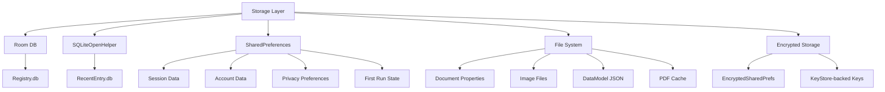

# Data Storage

## Overview

Lens uses multiple storage mechanisms depending on data type:



## Room Database

### Registry.db

A platform-level registry database used by Office shared components.

**Table: RegistryKey**
| Column | Type | Notes |
|--------|------|-------|
| `id` | INTEGER | PK, autoincrement |
| `name` | TEXT | Collate NOCASE |
| `parent_id` | INTEGER | FK to self |

**Table: RegistryValue**
| Column | Type | Notes |
|--------|------|-------|
| `id` | INTEGER | PK, autoincrement |
| `key_id` | INTEGER | FK to RegistryKey |
| `name` | TEXT | Collate NOCASE |
| `type` | INTEGER | Enum: RegistryValueType |
| `data` | TEXT | Serialized value |

**Table: RegistryDBStatus**
| Column | Type |
|--------|------|
| `id` | INTEGER |
| `status` | TEXT (UNIQUE) |

**Table: RegistryUpdate**
| Column | Type |
|--------|------|
| `id` | INTEGER |
| `last_update_process_id` | INTEGER |
| `last_update_time` | INTEGER |

## SQLite Database

### RecentEntry.db (Version 11)

```sql
CREATE TABLE recent_entry (
    _id INTEGER PRIMARY KEY,
    title TEXT,
    date_added INTEGER,
    service TEXT,
    state INTEGER,
    image_filename TEXT,
    task_id TEXT,
    client_url TEXT,
    web_url TEXT,
    embed_url TEXT,
    dav_url TEXT,
    download_url TEXT,
    owner TEXT,
    caption TEXT,
    item_id TEXT,
    thumbnail_name TEXT,
    downloaded_filename TEXT,
    filename_location TEXT
);
```

Used by: `RecentEntryDbHelper`, `UploadTaskManager`, `ThumbnailHelper`, `RecentEntryAdapter`

## SharedPreferences

### Named Preference Files

| File | Content |
|------|---------|
| `SessionManager` | Editing document ID, last bucket ID |
| `LENSHVCSESSIONID` | HVC session IDs |
| `LENSHVCINTUNEIDENTITY` | Session UUID → MAM identity mapping |
| `LENSHVCIMAGEPRESENT` | Session UUID → image presence flag |
| `fre.preference` | First-run experience state |
| `whatNewFre.preference` | What's new FRE version |
| `STORAGEPATH` | Temp storage directory path |
| `nextLaunchIsClean` | Cleanup-on-launch flag |

### Account Preferences (Default SharedPreferences)

| Key | Type | Purpose |
|-----|------|---------|
| `selected_account` | String | Selected account ID |
| `selected_account_display_name` | String | Display name |
| `selected_account_first_name` | String | First name |
| `selected_account_type` | int | AccountType enum |
| `signed_in_accounts` | String | JSON-serialized IdentityMetaDataList |
| `signed_out_accounts` | String | JSON-serialized AccountList |
| `private_synced_urls` | String | JSON-serialized SyncedUrlMap |
| `edog_custom_url` | String | Debug endpoint override |

### Privacy Preferences (Default SharedPreferences)

| Key | Purpose |
|-----|---------|
| `olAnalyzeContent` | Remote analysis opt-in |
| `privacy_option_analyze_content_local` | Local analysis opt-in |
| `olDiagnosticLevel` | Telemetry level (0=none, 1=required, 2=full) |
| `olDownloadContent` | Content download opt-in |
| `olCCS` | Connected Content Services consent |
| `olCCSAllowed` | CCS roaming allowed |
| `olSettingsMigrated` | First-run settings migration flag |

### First Run Preferences (`fre.preference`)

| Key | Purpose |
|-----|---------|
| `freVersionSeen` | Last FRE version shown |
| `FirstTimeUser` | Whether user is first-time |
| `IsNewUserForCaptureFlow` | New capture flow flag |
| `accepted.use.terms.version` | Accepted TOS version |
| Per-workflow booleans | Per-workflow FRE completion |

### Feature Gates

The app uses ramp flags and feature gates stored in the Registry database and SharedPreferences, including:
- `EnableSslPinning` — certificate pinning for business accounts
- `RevertOkHttpConnectionPoolIncrease` — connection pool behavior
- Various `DeviceConfig` entries for premium feature flags

## File-Based Storage

### Document Storage

Documents are stored as Java `.properties` files:

```
{filesDir}/documents/{uuid}.document
```

Format:
```properties
images.0=<image-uuid>
images.1=<image-uuid>
```

### Data Model Persistence

Session document models are persisted as JSON:

```
{rootPath}/per/{uuid}.json
```

Serialized via `DataModelSerializer` with `Page` and `Document` types.

### Image Files

| Type | Path |
|------|------|
| Captured images | `{filesDir}/images/` |
| Uploads | `{filesDir}/uploads/` |
| OCR | `{filesDir}/ocr/` |
| PDF output | `Documents/Office Lens/` (external) |
| Gallery save | `Pictures/Office Lens/` (external) |
| Share cache | `{cacheDir}/sharePdf/` |
| Business card downloads | `Downloads/OfficeLens/` |

## Encrypted Storage

### Encryption Key Hierarchy

```
Android KeyStore (hardware-backed)
  └─ MasterKey (AES-256 GCM)
       └─ EncryptedSharedPreferences
            ├─ Account tokens
            ├─ ADAL token cache
            └─ Sensitive settings
```

### CryptoUtils

| Parameter | Value |
|-----------|-------|
| Algorithm | AES/CBC/PKCS5Padding |
| Key derivation | SHA-256 |
| Seed | SecureRandom (SHA1PRNG), 16 bytes |
| Legacy fallback | AES/ECB/NoPadding |

### ADAL Cache Encryption

- Algorithm: PBEWith SHA256
- Iterations: 100
- Salt: `"com.microsoft.office.onenote"`
- Key size: 256-bit AES

## Cache Management

- **Startup cleanup**: Deletes `STORAGEPATH` directory contents
- **Session cleanup**: `SessionManager.clearSdkSession()` clears HVC session caches
- **Document deletion**: Removes `per/` directory and `.document` files
- **Gallery cleanup**: `RecentEntryAdapter` cleans up `Pictures/Office Lens` and `Documents/Office Lens`

## Serialization

| Library | Usage |
|---------|-------|
| Gson | Account data, EncryptionResult, Registry JSON export |
| org.json | REST API responses, auto-discovery, share intents |
| Java Properties | DocumentDao entity storage |
| DataModelSerializer | Custom Kotlin serializer for document model JSON |
| Moshi | Available but not used by app code |
