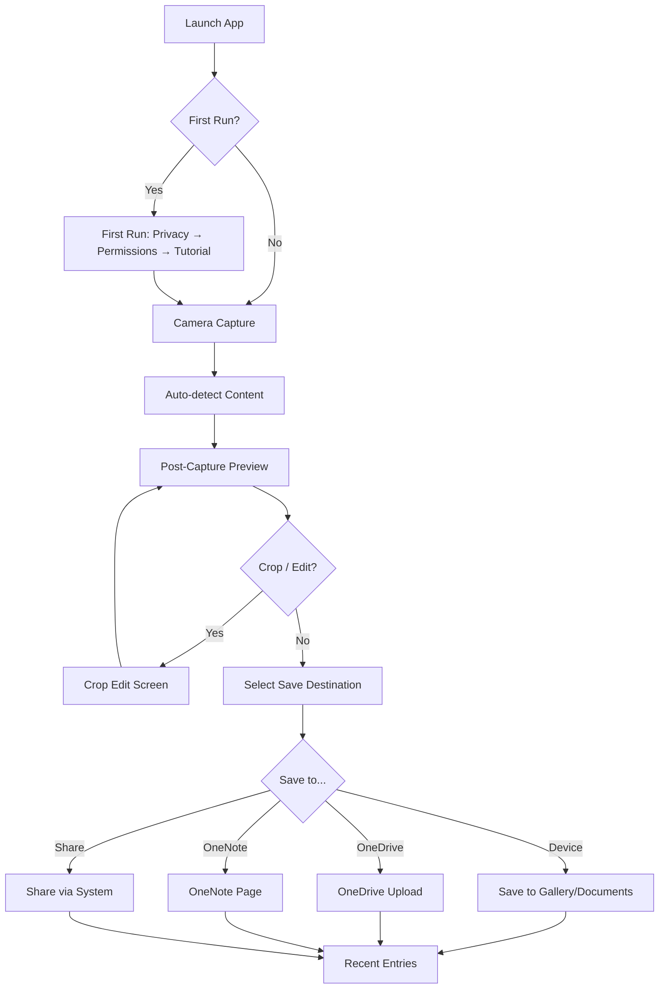
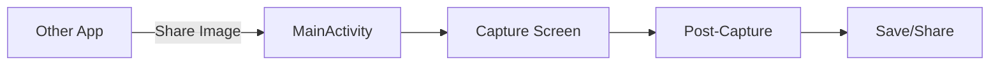

# User Interface Documentation

## Overview

Microsoft Lens has **337 layout XML files**, **626 drawable resources**, and supports **110+ locales**. The UI uses AppCompat Light theme with no action bar, brand orange primary color (`#d83b01`), and extensive custom styling prefixed `lenshvc_`.

## Screen-by-Screen Walkthrough

### 1. Splash Screen

- **Activity**: `MainActivity` with `@style/OfficeLensSplashTheme`
- **Purpose**: App launch, initialization
- **Transitions**: → First Run (if new user) → Main camera

### 2. First Run Experience

- **Activity**: `FirstRunActivity` with `@style/OfficeLensFirstRunTheme`
- **Fragments**:
  - `FrePrivacyFragment` — privacy consent
  - `UseTermsFragment` — terms of use acceptance
  - `VideoExperienceFragment` — tutorial videos (`fre_video_pocket_scanner.mp4`, `fre_video_save_edit_go.mp4`)
  - `WhatsNewFragment` — what's new in this version
  - `VideoPageFragment` — individual video player
  - `PermissionRequestActivity` — camera/storage permission grant
- **Theme**: Portrait orientation, full-screen
- **Controls**: Accept/Decline buttons, video player, page indicator
- **State**: Tracks `freVersionSeen`, `FirstTimeUser`, `accepted.use.terms.version` in `fre.preference`

### 3. Capture Screen (Main Camera)

- **Activity**: `MainActivity` → `LensActivity` → `CaptureFragment`
- **Layout**: `capture_fragment.xml`
- **Controls**:
  - Camera viewfinder (full-screen)
  - Capture button (shutter)
  - Mode selector (bottom sheet/picker): Document, Photo, Whiteboard, Business Card, QR Code, Video, Auto
  - Flash toggle
  - Gallery preview button (recent captures)
  - Settings button (overflow menu)
- **Overflow Menu** (`popup_menu_capture.xml`):
  - Recent
  - Settings
- **Navigation**: Bottom (Recent, Mode, Gallery)
- **Camera**: CameraX/Camera2 with auto-focus, tap-to-focus, pinch-to-zoom
- **Auto-detection**: Automatic document/whiteboard border detection using ONNX models

### 4. Post-Capture Screen

- **Activity**: `LensActivity` → `PostCaptureFragment`
- **Layout**: `postcapture_fragment.xml`
- **Controls**:
  - Image preview with auto-crop overlay
  - Re-capture button
  - Accept button
  - Color/grayscale filter selector
  - Crop tool button
  - Ink/annotation tools
  - Text sticker tool
  - Rotate controls
- **Actions** (bottom bar): Re-take, Crop, Filters, Ink, Save
- **Navigation**: Swipe or tap through multi-page captures

### 5. Crop/Edit Screen

- **Layout**: `crop_fragment_k2.xml`
- **Controls**:
  - Resizable crop rectangle with handles
  - Aspect ratio presets
  - Rotate slider
  - Perspective correction
  - Apply/Cancel buttons
- **Filters**: Original, Color, Grayscale, Document mode

### 6. Gallery / Recent Items

- **Activity**: `ImmersiveGalleryActivity`
- **Layout**: Grid view of recent captures
- **Controls** (`recent_entry.xml` menu):
  - Edit
  - Share
  - Delete
- **Navigation**: Tap to view full-screen, swipe to navigate
- **Data Source**: `RecentEntryDbHelper` (SQLite)

### 7. Save Screen

- **Layout**: Bottom sheet / full-screen
- **Options**:
  - Save to device gallery
  - Save to OneDrive/SharePoint
  - Save to OneNote
  - Share to other apps (PDF, images)
  - Print
  - Copy to clipboard
- **Format options**: PDF, DOCX, PPTX, images (PNG/JPEG)
- **Location picker**: OneDrive folder browser (`FolderListFragment`)

### 8. Settings Screen

- **Activity**: `SettingsActivity`
- **Fragments**: `SettingsFragment` (extends `PreferenceFragment`)
- **Layout**: `preferences.xml`
- **Sections**:
  - **Account**: Signed-in account, add/remove account
  - **Help & Support**: FAQ link, send feedback
  - **About**: Version, copyright, licenses
  - **Hidden**: EDOG URL (debug/internal endpoint)
- **Actions**:
  - Sign in / Sign out
  - Clear cache
  - Send feedback
  - Privacy settings

### 9. About Screen

- **Activity**: `AboutActivity`
- **Content**: App version, copyright, third-party licenses, privacy link

### 10. Sign-In / Account Picker

- **Activity**: `AccountPickerActivity`, `SignInWrapperActivity`
- **Layout**: `account_picker_panel.xml` (bottom sheet)
- **Controls**:
  - Personal account (Microsoft Account)
  - Business account (Azure AD / work/school)
  - Add account button
  - Sign out option
- **Auth methods**: Microsoft SSO, device broker (Company Portal), username+password

### 11. Immersive Reader

- **Activity**: `IRActivity`
- **Layout**: Full-screen reading experience
- **Features**:
  - Text-to-speech with playback controls
  - Font size adjustment
  - Line focus
  - Grammar tools (syllables, parts of speech)
  - Translation
  - Picture dictionary

### 12. Barcode Scanner

- **Layout**: `BarcodeScanFragment`
- **Features**:
  - QR Code scanning
  - Barcode scanning (various formats)
  - Result bottom sheet: `qr_code_result_bottom_sheet_layout.xml`
  - Copy result / Open URL / Share

### 13. Business Card Screen

- **Workflow**: ImageToEntity extraction
- **Features**:
  - Auto-detect contact fields
  - Save to device contacts
  - Export to Outlook/Exchange contacts
  - Extract and display: name, phone, email, address, company, job title

### 14. Copilot Integration

- **Fragment**: `LensCopilotFragment`
- **Integration**: Microsoft Copilot (Bing Chat Enterprise) for AI-powered document analysis
- **Policy-controlled**: Requires Intune policy `BingChatEnterprise.IsAllowed`

## User Flows

### Main Scanning Flow

### Share-to-Lens Flow

## Dialogs

| Dialog Fragment | Purpose |
|-----------------|---------|
| `ErrorDialogFragment` | Error messages |
| `ProgressDialogFragment` | Loading/processing indicator |
| `ProgressBarDialogFragment` | Progress bar for long operations |
| `UpgradeDialogFragment` | Upgrade-to-premium prompts |
| `GetPdfViewerDialogFragment` | PDF viewer installation prompt |
| `OneNoteCrossSellDialogFragment` | OneNote cross-promotion |
| `SendFeedbackDialogFragment` | Feedback form |
| `PdfDialogFragment` | PDF utility dialogs |
| `PdfOpenerFragment` | PDF opening progress |

## Navigation & Menus

- **Primary navigation**: Bottom bar / popup menu
- **Overflow menu**: Settings, Recent
- **Context menus**: Edit, Share, Delete on gallery items
- **Bottom sheets**: Account picker, mode selector, save destination, QR results

## Theming

- **Primary**: `#d83b01` (Microsoft orange)
- **Accent**: `#0078d4` (Microsoft blue)
- **Dark mode variants**: Full night theme support (`values-night/`)
- **RTL support**: Layout mirroring (`values-ldrtl/`, `drawable-ldrtl/`)
- **Foldable**: Layout variants for foldable/surface duo devices
- **Watch**: Wear OS layout variants (`layout-watch/`)
