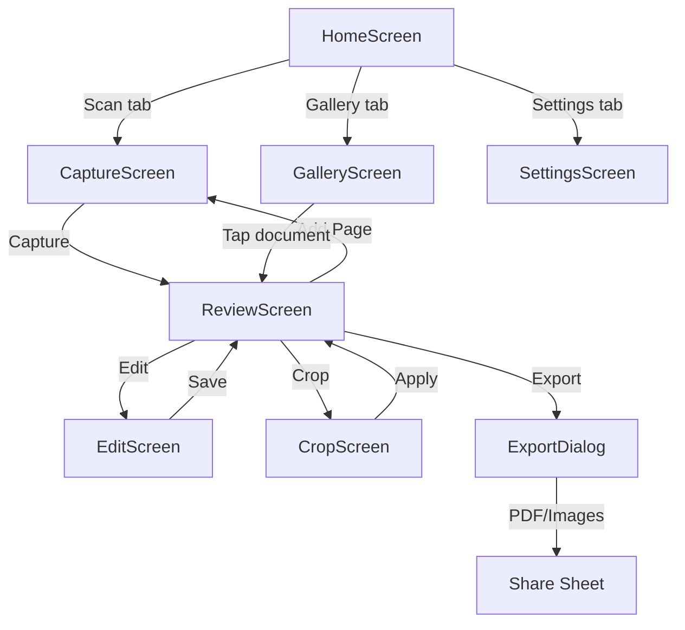
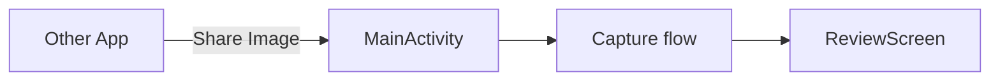

# User Interface Documentation

## Overview

OpenScan uses **Jetpack Compose** with **Material 3** design. All UI is declarative, state-driven, and rendered within a single `MainActivity`. The app uses a green primary color scheme with dark/light theme support.

## Screen-by-Screen Walkthrough

### 1. Home Screen

- **Route**: `HOME`
- **File**: `ui/home/HomeScreen.kt`
- **Layout**: Bottom navigation bar with three tabs: Scan (camera), Gallery (grid), Settings (gear)
- **Default tab**: Scan (launches CaptureScreen embedded in the tab)

### 2. Capture Screen

- **Route**: `CAPTURE`
- **File**: `ui/capture/CaptureScreen.kt`
- **ViewModel**: `CaptureViewModel`
- **Controls**:
  - CameraX `PreviewView` via `AndroidView` composable
  - Shutter FAB → captures photo to `captured/capture_<timestamp>.jpg`
  - When pages > 0: "Done (N)" FAB → navigates to Review
  - Flash toggle (auto/manual)
  - Gallery preview thumbnail (last captured page)
- **Permissions**: `CameraPermissionManager` composable wraps `ActivityResultContracts.RequestPermission`
- **Data flow**: First capture creates a `Document` in Room; subsequent captures add `Page` records

### 3. Review Screen

- **Route**: `REVIEW/{documentId}`
- **File**: `ui/review/ReviewScreen.kt`
- **ViewModel**: `ReviewViewModel`
- **Top bar**: Document title, Export (share icon), Delete (trash icon)
- **Main area**: Selected page displayed via Coil `AsyncImage`
- **Overlay buttons**: Crop (Tune icon), Edit (filters icon)
- **Bottom bar**: "Add Page" button → returns to Capture
- **Page strip**: `LazyRow` of page thumbnails with selection highlight and delete on each
- **Dialogs**: `ExportDialog` (PDF/Images), OCR result dialog
- **Actions**: OCR text extraction, barcode scanning on the displayed page

### 4. Edit Screen

- **Route**: `EDIT/{pageId}`
- **File**: `ui/edit/EditScreen.kt`
- **ViewModel**: `EditViewModel`
- **Top bar**: Back arrow, Save (checkmark)
- **Image display**: Filtered/rotated bitmap
- **Filter chips**: Original, Grayscale, Document
- **Rotate**: 90° clockwise button
- **Logic**: Applies `ImageProcessor` filters (`toGrayscale`, `enhanceDocument`), persists via `updatePageEnhancements`

### 5. Crop Screen

- **Route**: `CROP/{pageId}`
- **File**: `ui/crop/CropScreen.kt`
- **ViewModel**: `CropViewModel`
- **Two-stage crop**:
  - **Stage 1 — Perspective**: 4 draggable corner handles on a Canvas to align with document edges. Applies `ImageProcessor.warpPerspective` to correct perspective.
  - **Stage 2 — Standard**: Drag rectangle edges/corners for fine crop. Applies `ImageProcessor.standardCrop`.
- **Gestures**: Canvas `drawRect` / `drawCircle` with `detectDragGestures`
- **Persistence**: Saves crop points and rect via `updatePageCrop`

### 6. Gallery Screen

- **Route**: `GALLERY`
- **File**: `ui/gallery/GalleryScreen.kt`
- **ViewModel**: `GalleryViewModel`
- **Layout**: `LazyVerticalGrid` of document cards
- **Thumbnails**: Loaded via Coil from `document.thumbnailPath`
- **Empty state**: Icon + "No documents yet" text
- **Tap**: Navigates to `REVIEW/{documentId}`

### 7. Export Dialog

- **File**: `ui/export/ExportDialog.kt`
- **ViewModel**: `ExportViewModel`
- **Options**: PDF button, Images button
- **PDF**: Builds `PdfDocument` from page images (uses `enhancedPath` if available, falls back to `imagePath`)
- **Images**: Writes pages as JPEG files
- **Sharing**: Uses `ShareHelper` with `FileProvider` URIs and `ACTION_SEND`/`ACTION_SEND_MULTIPLE` intents

### 8. Settings Screen

- **Route**: Settings tab in HomeScreen
- **File**: `ui/settings/SettingsScreen.kt`
- **Content**:
  - App version name
  - License (MIT)
  - Privacy note (all processing is on-device)

## User Flows

### Main Scanning Flow

### Share-to-Scan Flow

## Dialogs

| Dialog | Purpose |
|--------|---------|
| `ExportDialog` | Format picker (PDF, Images) |
| `OcrResultDialog` | Display recognized text |
| `PermissionRequestView` | Camera permission rationale |

## Theming

- **Primary**: Green (`#4CAF50` variant) — see `ui/theme/Color.kt`
- **Tertiary**: Orange accent
- **Surfaces**: Light/dark variants defined in `Color.kt`
- **Dynamic color**: Android 12+ dynamic color support in `Theme.kt`
- **Status bar**: Managed via `SideEffect` with `accentBarTheme` utility
- **Typography**: `headlineLarge`, `headlineMedium`, `titleLarge`, `bodyLarge`, `bodyMedium`, `labelLarge` — defined in `Type.kt`
